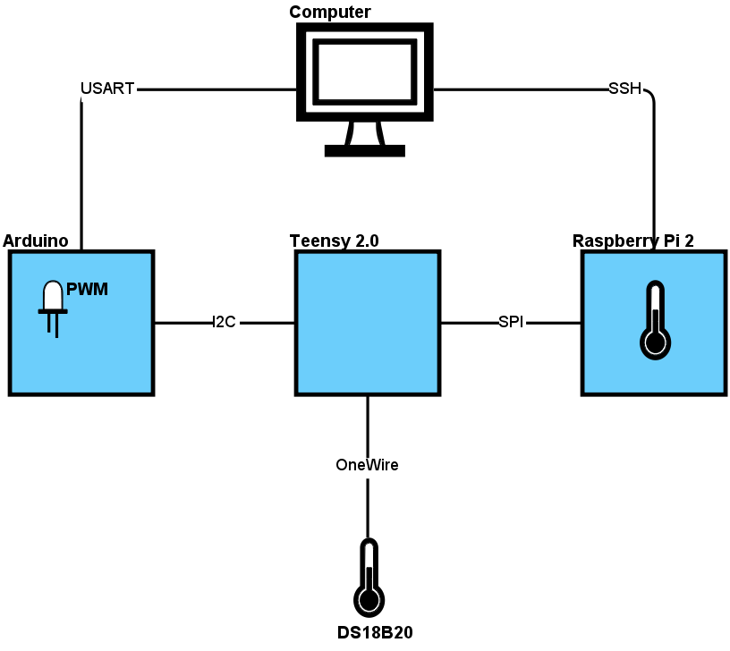

#Project Overview

##Top-Level Diagram

##Master Control Flow

##Slave Control Flow

##Mastery Challenges
  - Arduino
    - [ ] Level 2 (Demonstrate 1 protocol, PWM, module)
    - [ ] Level 3 (Demonstrate I2C/SPI/USART between boards)
  - [ ] Port this to C
    - AVR Microcontrollers
      - [ ] Implement I/O, interrupts, watchdog, timers, adc
      - [ ] Level 2 (Demonstrate all aspects)
      - [ ] Level 3 (Write timed assembly)
    - Embedded Communication
      - In depth knowledge of I2C,SPI,UART,I2S,OneWire,LVDs
      - [ ] Level 1 (Demonstrate 2 protocols)
      - [ ] Level 2 (Demonstrate 4 protocols)
      - [ ] Level 3 (Demonstrate LVDs)?
